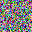
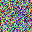
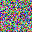
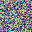
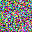
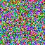

# RANDOM BITMAP GENERATOR

Pequeño fuente que genera bitmaps de 64x64 con colores aleatorios.










A mayor parámetro de altura y anchura mayor "ruido" generado en la imagen.



<br>
<br>
<br>

## Compilación

```c
gcc main.c -o random
```

## Ejecución

```c
./random
```
